# SmartGrasp Perception 流程图

```mermaid
flowchart TD
    START([开始: perception.py 入口]) --> ARGPARSE[解析命令行参数<br/>scene_id, epsilon, kernel_size,<br/>sam2参数, review参数等]
    
    ARGPARSE --> D1

    subgraph DATA[数据加载]
        D1[读取 Parquet 文件<br/>获取场景RGB图像、<br/>annotation语言标注、<br/>queryObjId目标物体ID]
        D2[查找匹配的 NPZ 文件<br/>depth 深度图<br/>instances_objects 实例掩码<br/>instances_semantic 语义掩码]
        D3[保存 scene_image.png<br/>保存 depth.npy]
        D1 --> D2 --> D3
    end

    D3 --> STAGE1

    subgraph STAGE1["① 背景排除掩码生成"]
        B1["深度阈值过滤<br/>depth >= 79.8 → 托盘/背景种子"]
        B2["HSV颜色扩展<br/>分析种子区域色调分布<br/>扩展至相邻同色背景区域"]
        B3["形态学清理<br/>输出 background_exclusion_mask"]
        B1 --> B2 --> B3
    end

    B3 --> STAGE2

    subgraph STAGE2["② SAM2自动生成 → VLM审阅 → LangSAM精炼"]
        subgraph S2A["②a SAM2 自动掩码生成"]
            A1["加载 LangSAM 模型<br/>配置生成参数"]
            A3["SAM2 自动生成候选掩码<br/>sam.generate(image)"]
            A4["候选过滤:<br/>• 面积过滤 min/max area_ratio<br/>• 边界接触过滤<br/>• 支撑面/托盘类过滤<br/>• 背景重叠过滤<br/>按综合评分排序<br/>(pred_iou + stability + area_prior - border_penalty)"]
            A5["SAM2候选列表<br/>例: #1 bbox=[102,45,156,98] iou=0.94<br/>　  #2 bbox=[200,312,260,380] iou=0.88<br/>　  ...共80~120个<br/>每项含: id, mask, bbox, predicted_iou, stability"]
            A6["生成辅助图像:<br/>• label_1_sam2auto.png (编号叠加)<br/>• sam2_rgb_parts_sheet.png (切割图集)"]
            A1 --> A3 --> A4 --> A5 --> A6
        end

        A5 --> B_API2
        A6 --> B_API2

        subgraph S2B["②b VLM 双重审阅 (OpenAI API)"]
            B_API1["API调用1: 场景物体清单<br/>输入: 仅原始场景图像<br/>输出例: {id:1, description:'红黄钳子',<br/>　 position:'右下', visible_parts:['红色手柄','黑色钳口']}<br/>　 ... 每个物理物体一条<br/>忽略托盘/桌面/背景/阴影"]

            B_API2["API调用2: SAM2掩码分配<br/>输入: 原始图 + 编号叠加图 + 切割图集<br/>　 + 物体清单 + SAM2候选列表<br/>输出例: {id:1, description:'红黄钳子',<br/>　 sam2_ids:[3,7,12], status:'complete'}<br/>　 {id:2, description:'蓝色螺栓', sam2_ids:[], status:'missing'}"]
            
            B_API1 --> B_API2
        end

        B_API2 --> C0

        subgraph S2C["②c LangSAM 精炼"]
            C0["构建SAM2锚点 (anchor_mask)<br/>例: 钳子 sam2_ids=[3,7,12]<br/>→ anchor = mask#3 ∪ mask#7 ∪ mask#12<br/>= 3个碎片合并出的钳子大致轮廓"]
            C1["LangSAM 文本分割:<br/>以物体描述作为提示词<br/>预测掩码 (Grounding DINO + SAM)"]
            C2["多因素评分选择最佳:<br/>• 语义得分 × 3<br/>• SAM2锚点覆盖 × 2<br/>• 锚点内部比例 × 0.5<br/>• 背景重叠惩罚 × -2"]
            C1 --> C2
            C2 --> C3
            C0 --> C3
            C3["融合输出<br/>例: 对齐→ anchor ∪ langsam (并集)<br/>　 不对齐/太小/太大 → 回退用anchor"]
            B_API1 --> C1
        end

        C3 --> S2D

        subgraph S2D["②d 未认领SAM2候选保留"]
            D2_1["收集未被VLM认领的<br/>高质量SAM2候选掩码"]
            D2_2["基于深度连续性分组<br/>depth_gap ≤ 0.012 → 合并<br/>depth_gap > 0.012 → 分开"]
            D2_3["合并同组掩码<br/>按面积+评分排序<br/>过滤面积 < 0.07%<br/>最多保留 N 个"]
            D2_1 --> D2_2 --> D2_3
        end
    end

    D2_3 --> STAGE3

    subgraph STAGE3["③ 最终化为非重叠独立掩码"]
        F1["去重 & 重叠消解:<br/>按 explicit_score + area 排序<br/>后分配的掩码裁去与先分配的重叠部分"]
        F2["智能碎片过滤:<br/>• 面积 < 0.07% → 丢弃<br/>• 重叠损失 > 90% 且剩余 < 0.3% → 丢弃<br/>(避免被其他物体裁碎后残留的噪声碎片)"]
        F3["重新编号物体<br/>(1, 2, 3, ...)"]
        F4["生成最终可视化:<br/>label_2_VLM_langsam.png<br/>label_3_final.png"]
        F5["保存背景掩码:<br/>000_background.png"]
        F1 --> F2 --> F3 --> F4 --> F5
    end

    F5 --> STAGE4

    subgraph STAGE4["④ 遮挡关系图构建"]
        O1["对每对物体 (i, j):<br/>膨胀掩码 → 找接触区域"]
        O2["接触区域有效性检查:<br/>• contact_pixels >= min_contact_pixels<br/>• contact_ratio >= min_contact_ratio"]
        O3["比较接触区域深度中位数:<br/>depth_i < depth_j - epsilon<br/>→ i 遮挡 j (i更靠近相机)<br/>添加有向边 i → j"]
        O4["生成输出:<br/>occlusion_graph.json<br/>occlusion_graph.png<br/>(箭头方向: 遮挡者→被遮挡者)"]
        O1 --> O2 --> O3 --> O4
    end

    O4 --> SUMMARY

    subgraph SUMMARY[汇总输出]
        S1["perception/ 目录<br/>summary.json 总结果"]
        S2["包含:<br/>• 场景元信息<br/>• 物体点列表<br/>• 遮挡矩阵 occlusion_matrix<br/>• occlusion_graph.json/png"]
        S1 --> S2
    end

    S2 --> END([结束])
```



## 感知流程详解

### 总览

SmartGrasp 感知管道（Perception Pipeline）的核心任务是：**从一张场景RGB图像和深度图出发，识别所有可抓取物体，并推断它们之间的遮挡关系**。整个过程不依赖真值掩码，用视觉模型自动完成物体发现、分割和遮挡推理。

---

### 阶段 ①：背景排除掩码生成

**目的**：自动识别托盘、桌面等不可抓取背景区域，后续所有阶段都会用此掩码排除背景干扰。

**方法**：
- 利用场景特殊性——托盘底部距离相机最远，深度值最大（≥79.8）
- 从深度种子出发，用HSV色彩空间扩展至相邻同色背景（如绿色托盘壁）
- 形态学清理后输出二值化背景掩码

---

### 阶段 ②：SAM2 → VLM → LangSAM 三级联

这是整个管道最核心的部分，采用**粗筛 → 语义理解 → 精修**的级联策略：

---

#### ②a SAM2 自动掩码生成

对 RGB 图像做无先验过度分割，产生 80~120 个候选掩码（碎片），每个附带位置和质量评分。

**输出示例**（sam2 候选列表）：
```json
[
  {"id":1,  "bbox":[102,45,156,98],   "area_ratio":0.0032, "predicted_iou":0.94, "stability":0.91},
  {"id":2,  "bbox":[200,312,260,380], "area_ratio":0.0120, "predicted_iou":0.88, "stability":0.85},
  {"id":3,  "bbox":[580,120,720,310], "area_ratio":0.0250, "predicted_iou":0.96, "stability":0.93},
  ...
]
```
同时生成两张辅助图：`label_1_sam2auto.png`（掩码轮廓 + 编号叠加）、`sam2_rgb_parts_sheet.png`（每个编号碎片的裁剪特写）。

---

#### ②b VLM 双重审阅（OpenAI API）

**第一轮（场景物体清单）**：只输入原始场景图，输出每个物理物体的名称、位置、可见部件。

**输出示例**（openai_scene_objects.json）：
```json
[
  {"id":1, "description":"tall white cylindrical roll standing vertically, partly hidden behind the left Melitta package",
   "relative_position":"upper left", "visible_parts":["white cylindrical body","rounded top edge"]},
  {"id":2, "description":"off-white rectangular box lying diagonally",
   "relative_position":"upper center", "visible_parts":["cream faces","small blue marking on side"]},
  ...
]
```

**第二轮（SAM2 掩码分配）**：输入原始图 + 编号叠加图 + 切割图集 + 物体清单 + SAM2 候选列表，输出每个物体由哪些 SAM2 碎片组成。

**输出示例**（sam2_review.json）：
```json
[
  {"id":1, "scene_object_id":1, "description":"tall white cylindrical roll...",
   "sam2_ids":[4], "status":"complete"},
  {"id":2, "scene_object_id":2, "description":"off-white rectangular box...",
   "sam2_ids":[1], "status":"complete"},
  {"id":3, "scene_object_id":3, "description":"green patterned rectangular sponge...",
   "sam2_ids":[2,25], "status":"complete"},
  ...
]
```

---

#### ②c LangSAM 精炼

对每个审阅物体：**构建 SAM2 锚点**（按 `sam2_ids` 从候选列表取掩码求并集），然后以物体描述为提示词跑 LangSAM 文本分割。用多因素评分选最佳掩码，最终与锚点融合。

**锚点示例**（以物体 5 "Melitta 包装" 为例）：
```
sam2_ids = [9, 11, 14, 16, 17, 18, 20, 21, 22, 23, 29, 36, 38, 39]
anchor_mask = candidates[9] | candidates[11] | ... | candidates[39]
→ 14个碎片的并集，覆盖 Melitta 包装的大致区域
```

**融合策略**：
- LangSAM 掩码与锚点对齐 → 取并集（`anchor ∪ langsam`）
- LangSAM 面积 < 0.07% → 回退用锚点
- LangSAM 与锚点不对齐 / 过大 → 回退用锚点

---

#### ②d 未认领 SAM2 候选保留

收集 VLM 未认领的剩余候选，按深度连续性分组（`depth_gap ≤ 0.012` 合并），过滤面积 < 0.07%，最多保留 N 个作为补充物体。

---

### 阶段 ③：最终化为非重叠掩码

**目的**：确保每个像素最多属于一个物体，消除掩码间的重叠冲突。

**策略**：
- 按优先级排序（VLM明确分配的 > SAM2自动候选），后分配的掩码裁去与先分配的掩码重叠的像素
- 三层智能碎片过滤：
  - **绝对最小面积**：面积 < 0.07%（~1008px）→ 直接丢弃
  - **重叠损失检测**：重叠消解后面积损失 > 90% 且剩余 < 0.3%（~4320px）→ 视为被其他物体裁碎的噪声，丢弃
  - 避免出现原始分割正常（如 50K px）但被其他物体裁掉 97% 后残留的微小碎片
- 最终重新编号为 1, 2, 3...

---

### 阶段 ④：遮挡关系图构建

**核心算法**：

1. 对每对物体 $(i, j)$，膨胀掩码后求交集作为**接触区域**
2. 过滤弱接触（像素数太少 或 占比较小物体的比例太低）
3. 在接触区域内分别取深度中位数 $\text{median}_i$, $\text{median}_j$
4. 若 $\text{median}_i < \text{median}_j - \epsilon$，则 $i$ 遮挡 $j$（$i$ 更靠近相机，在俯拍场景中即 $i$ 在 $j$ 上方）

**输出**：有向无环图（DAG），边方向为 **遮挡者 → 被遮挡者**，附带深度差、接触比例等量化信息。
