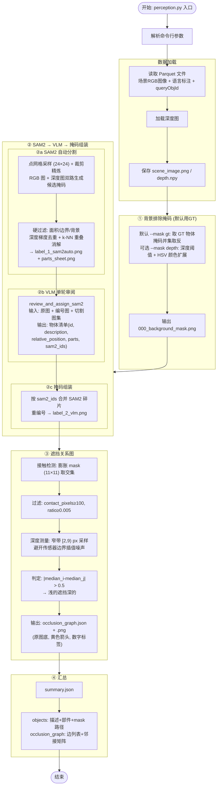

# SmartGrasp Perception 流程图



## 感知流程详解

### 总览

从场景 RGB 图像和深度图出发，SAM2 自动分割 + VLM 语义审阅 + 深度窄带采样判定遮挡。

---

### ① 背景排除

默认使用 GT 真值物体掩码的并集取反（`--mask gt`）。可选 `--mask depth` 用深度阈值 + HSV 颜色扩展自动识别。

---

### ② SAM2 → VLM → 掩码组装

#### ②a SAM2 自动分割

SAM2（Segment Anything Model 2）在 RGB 图像和深度图上分别运行自动掩码生成。核心机制：

**点网格采样（points_per_side=24）**：在图像上铺设 24×24 均匀网格点，每个点作为提示生成一个候选掩码。网格密度决定分割粒度——越密碎片越多。

**裁剪精炼（crop_n_layers=0）**：将图像裁剪为重叠子区域（`crop_overlap_ratio`），对每个子区域独立生成掩码后再合并。crop_n_layers 控制裁剪递归深度。当前设为 0（不裁剪），依赖密集点网格覆盖。

**质量评分**：每个候选掩码附带 `predicted_iou`（预测的 IoU 质量）和 `stability_score`（在不同阈值下掩码的稳定性）。综合评分 = `predicted_iou + 0.25 × stability_score`。

**双路生成**：RGB 图生成一路候选，深度图（归一化为近白图像）另生成一路。两路候选合并后，通过深度梯度边缘进行去重和补全——RGB 候选与深度候选在空间上互补。

**硬过滤**：
- 面积过滤：`min_area_ratio=0.006` ~ `max_area_ratio=0.11`（过小或过大的碎片丢弃）
- 边界接触：边界接触比例 > 18% 的掩码丢弃（防止截断物体）
- 背景重叠：与背景排除掩码重叠过多的候选降权或丢弃

**深度重叠消解**：候选掩码按深度排序，空间 k-NN（k=7）投票决定重叠区域归属——重叠像素分配给深度更浅（更靠前）的候选。

输出 `label_1_sam2auto.png`（掩码轮廓 + 编号叠加）和 `sam2_rgb_parts_sheet.png`（每个碎片的裁剪特写图集）。

#### ②b VLM 单轮审阅
`review_and_assign_sam2()`：一次 API 调用完成物体识别、描述、部件列举、SAM2 掩码分配。输出 `vlm.json`：

```json
{
  "objects": [
    {
      "id": 1,
      "description": "white rectangular block",
      "relative_position": "upper center",
      "sam2_ids": [1],
      "visible_parts": [
        {"description": "visible body", "sam2_ids": [1]}
      ]
    }
  ]
}
```

#### ②c 掩码组装
按 `sam2_ids` 取 SAM2 候选合并为最终掩码，重新编号后生成 `label_2_vlm.png`。

---

### ③ 遮挡关系图

#### 接触检测
膨胀掩码（11×11 核，每边扩 5px）取交集。过滤弱接触（< 100px 或比例 < 0.5%）。

#### 深度测量 — 窄带采样
不测接触区（边界传感器插值噪声），不测物体内部（深度跨度大）。在距对方边界 **[2, 9) px** 的窄带内取深度中位数——紧贴遮挡前沿，避开最噪的 0~2px。

#### 遮挡判定
`|median_i - median_j| > 0.5` → 浅的遮挡深的。

#### 参数

| 参数 | 默认值 | 含义 |
|------|--------|------|
| `kernel_size` | 11 | 膨胀核大小 |
| `min_contact_pixels` | 100 | 最小接触像素数 |
| `min_contact_ratio` | 0.005 | 最小接触面积比 |
| `band_lo` | 2 | 采样带内半径 (px) |
| `band_hi` | 9 | 采样带外半径 (px) |
| `depth_gap_threshold` | 0.5 | 深度差阈值 |

#### 输出
`occlusion_graph.png`：原图为底，亮黄色箭头示遮挡方向，白色数字标签标物体序号。

---

### ④ 汇总

`summary.json`：

```json
{
  "scene_id": 184,
  "objects": [
    {
      "object_id": 1,
      "label": "white rectangular block",
      "relative_position": "upper center",
      "centroid": {"x": 557, "y": 228},
      "mask_path": "mask/001_anchor_white_rectangular_block.png",
      "sam2_ids": [1],
      "parts": [
        {"description": "visible body", "sam2_ids": [1], "mask_paths": ["mask/001_...png"]}
      ]
    }
  ],
  "occlusion_graph": {
    "num_nodes": 9, "num_edges": 8,
    "edges": [
      {"source_object_id": 2, "target_object_id": 5, "depth_gap": 1.267, "contact_pixels": 265, "contact_ratio": 0.024}
    ],
    "adjacency_matrix": [[0,0,0,...], ...]
  }
}
```
