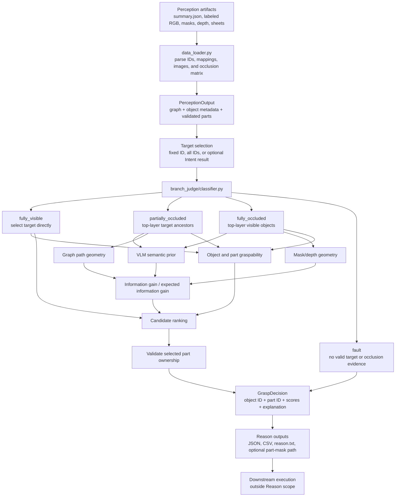

# SmartGrasp Reason: Architecture, Data Flow, and Scoring Overview

## 1. Overview

SmartGrasp Reason is the decision-making layer that converts structured scene
perception into the next grasp or object-removal action. It reads a scene
summary containing object IDs, labels, validated object-to-part mappings,
masks, depth, and a directed occlusion graph. A target is classified as fully
visible, partially occluded, fully occluded, or invalid. For a fully visible
target, Reason selects the target directly and evaluates object- and part-level
graspability. For an occluded target, it identifies only currently accessible
top-layer objects and ranks them as removal candidates.

The ranking process combines vision-language semantic judgments with geometric
evidence from graph paths, mask area, and depth. Depending on the configured
policy, it uses structural information gain or expected information gain,
optionally weighted by graspability. VLM part scores are validated against the
selected object's approved part IDs, preventing unrelated masks from being
exported. Reason produces structured JSON and CSV results, a human-readable
explanation, candidate-level scores, and an optional validated part-mask path
for downstream grasp localization. A simulated closed-loop mode can repeatedly
remove selected graph nodes until the target becomes directly graspable.

Reason does not generate Perception results, run GraspNet, plan robot motion,
or execute a physical grasp.

## 2. Implementation Baseline and Scope

| Item | Current value |
|---|---|
| Main entry point | `python -m reason.run_reason` |
| Reason model | `gpt-5.5` |
| VLM base URL | `https://yunwu.ai/v1` |
| Ranking used by the integrated pipeline | `ig_graspability` |

This document describes the current Reason implementation only. Perception,
Intent, GraspNet, PyBullet, and physical robot execution are external stages.

## 3. Reason Data Flow



### 3.1 Compact Runtime Sequence

```text
summary.json
  -> load PerceptionOutput
  -> resolve target object ID
  -> classify visibility branch
  -> build legal current candidate set
  -> obtain semantic, geometric, and graspability values
  -> compute IG or EIG
  -> rank candidates
  -> select object ID
  -> validate selected part ID and flat mask
  -> write Reason outputs
```

## 4. Overall Package Structure

```text
reason/
├── run_reason.py
├── run_reason.sh
├── schemas.py
├── data_loader.py
├── graspability.py
├── closed_loop.py
├── branch_judge/
│   └── classifier.py
├── fully_visible/
│   └── handler.py
├── partially_visible/
│   ├── handler.py
│   ├── prior.py
│   ├── geometry.py
│   └── scoring.py
├── invisible/
│   ├── handler.py
│   ├── prior.py
│   ├── geometry.py
│   └── scoring.py
├── vlm/
│   ├── config.py
│   ├── client.py
│   └── helper.py
├── intent_handle/
│   └── intent_handler.py
└── test_closed_loop_area.py
```

## 5. File Responsibilities

| File | Responsibility |
|---|---|
| `reason/run_reason.py` | Main CLI, target resolution, branch dispatch, result aggregation, and output writing |
| `reason/run_reason.sh` | Batch comparison wrapper for models and ranking configurations |
| `reason/schemas.py` | Defines `Branch`, `PerceptionOutput`, and `GraspDecision` |
| `reason/data_loader.py` | Loads `summary.json`, rebuilds the graph, loads masks/depth/images, and parses part ownership |
| `reason/branch_judge/classifier.py` | Selects `fully_visible`, `partially_occluded`, `fully_occluded`, or `fault` |
| `reason/fully_visible/handler.py` | Selects the target directly and optionally scores its graspability |
| `reason/partially_visible/handler.py` | Ranks currently removable top-layer ancestors of a visible target |
| `reason/partially_visible/prior.py` | Gets VLM semantic and graspability scores for target ancestors |
| `reason/partially_visible/geometry.py` | Computes graph path-product geometry and residual candidates |
| `reason/partially_visible/scoring.py` | Computes fusion, entropy, and structural information gain |
| `reason/invisible/handler.py` | Ranks top-layer visible objects when the target is missing |
| `reason/invisible/prior.py` | Gets VLM hidden-target probabilities and graspability |
| `reason/invisible/geometry.py` | Computes mask/depth hiding-capacity geometry |
| `reason/invisible/scoring.py` | Computes fusion, entropy, and expected information gain |
| `reason/graspability.py` | Requests and validates object-level and part-level graspability |
| `reason/vlm/config.py` | Stores Reason VLM model, base URL, timeout, and API-key variable |
| `reason/vlm/client.py` | Builds OpenAI-compatible multimodal requests and handles request fallbacks |
| `reason/vlm/helper.py` | Builds user prompts, encodes images, parses JSON, and filters invalid part IDs |
| `reason/closed_loop.py` | Simulates repeated graph-node removal without physical execution |
| `reason/intent_handle/intent_handler.py` | Optional language-to-object-ID resolution |
| `reason/test_closed_loop_area.py` | Tests equivalent-area preservation during simulated removal |

## 6. Inputs and Outputs

### 6.1 Main Inputs

```text
data/scene_<id>/perception/
├── summary.json
├── label_2_vlm.png
├── occlusion_graph.png
├── final_objects_sheet.png
├── object_parts_sheet.png
├── depth.npy
├── mask/
│   └── object masks
└── object_parts/
    └── part_<part-id>.png
```

Important `summary.json` fields:

- `object_points`: object IDs and labels.
- `matrix_labels`: object IDs corresponding to matrix rows and columns.
- `occlusion_matrix`: edge strengths; row object covers column object.
- `object_id_to_part_ids`: validated parts belonging to each object.
- `part_id_to_object_id`: reverse part ownership.
- Image and depth paths.

### 6.2 Main Outputs

```text
<out-root>/<model>/<prior-prompt>/<ranking-score>/
├── results.csv
├── branch_results.json
├── summary.json
├── reason.txt
└── scene_details/
    └── scene_<id>.csv
```

The selected action is represented by:

- `grasp_id` or `selected_object_id`: object ID.
- `selected_object_graspability`: object-level graspability.
- `selected_object_graspability_part_id`: selected part ID.
- `selected_object_graspability_parts`: all validated part scores.
- `grasp_part_mask.path`: optional flat part-mask path.

Object ID, part ID, graph node ID, and PyBullet body ID are different
namespaces.

## 7. Branch Logic

Let $t$ be the target and $G$ the directed occlusion graph. An edge
$a \rightarrow b$ means object $a$ covers or presses on object $b$.

| Condition | Branch | Action |
|---|---|---|
| $t \in G$ and $\operatorname{inDegree}(t)=0$ | `fully_visible` | Select target $t$ |
| $t \in G$ and $\operatorname{inDegree}(t)>0$ | `partially_occluded` | Rank top-layer ancestors of $t$ |
| $t \notin G$ and $\lvert E\rvert>0$ | `fully_occluded` | Rank all top-layer visible objects |
| $t \notin G$ and $\lvert E\rvert=0$ | `fault` | Return no action |

For a partially occluded target:

$$
A_t = \operatorname{Ancestors}_G(t)
$$

$$
C_t = \{i \in A_t \mid \operatorname{inDegree}_G(i)=0\}
$$

Only objects in $C_t$ can be selected now.

## 8. Semantic and Geometric Belief

For candidate $i$:

- $P_s(i)$: VLM semantic relevance or hidden-target probability.
- $P_g(i)$: graph or mask/depth geometric prior.
- $g(i)$: object-level graspability.
- $P(i)$: fused candidate belief.

The current product-of-experts fusion is:

$$
\tilde{P}(i)=P_s(i)P_g(i)
$$

$$
P(i)=\frac{\tilde{P}(i)}
{\sum_{j \in C}\tilde{P}(j)}
$$

Shannon entropy is:

$$
H(P)=-\sum_{i \in C}P(i)\log_2 P(i)
$$

### 8.1 Partial-Target Geometry

For every simple graph path $\pi$ from candidate $i$ to target $t$:

$$
P_g(i)=
\sum_{\pi:i\leadsto t}
\prod_{(u,v)\in\pi}r_{uv}
$$

where $r_{uv}$ is the occlusion ratio on edge $u\rightarrow v$.

### 8.2 Fully Hidden Geometry

The current hiding-capacity proxy uses visible area and depth:

$$
A_{\mathrm{eq}}(i)=
\frac{A_i+\sum_{k\in\operatorname{Pred}(i)}A_k}
{1+|\operatorname{Pred}(i)|}
$$

$$
h_i=\max(1,\ d_{\mathrm{ground}}-\bar{d}_i)
$$

$$
V_i=A_{\mathrm{eq}}(i)h_i
$$

$$
P_g(i)=\frac{V_i}{\sum_j V_j}
$$

This is a 2.5D geometric proxy, not a physical volume estimate.

## 9. Information Gain

### 9.1 Partially Occluded Target

For candidate removal $a$, Reason builds the residual graph $G_{-a}$ and
recomputes the candidate belief:

$$
IG_{\mathrm{partial}}(a)
=H(P_{\mathrm{before}})
-H(P_{\mathrm{after},a})
$$

If removing $a$ directly exposes the target, residual entropy is zero.

This is structural information gain because the candidate set can change after
removal.

### 9.2 Fully Occluded Target

For a hidden target, $P(a)$ is the probability that the target is behind
candidate $a$. A successful discovery has zero residual entropy; a miss has
belief $P_{\mathrm{miss},a}$:

$$
EIG_{\mathrm{hidden}}(a)
=H(P)
-(1-P(a))H(P_{\mathrm{miss},a})
$$

The current miss-side belief is geometry-based and does not make one new VLM
request for every hypothetical removal.

### 9.3 Normalized Information Gain

For $N=\lvert C\rvert$:

$$
IG_n(a)=
\frac{\max(0,IG(a))}
{\log_2(\max(2,N))}
$$

The same normalization is applied to hidden-target EIG.

## 10. Graspability and Part Selection

The VLM returns:

- $g(i)$: integrated object-level graspability.
- $q(i,p)$: graspability of validated part $p$ belonging to object $i$.

Object-level graspability evaluates whether the best visible region can be
grasped by a parallel gripper and used to remove the whole object. It considers
contact stability, thickness, clearance, collision risk, and whole-object
removal stability.

If the VLM provides a valid object-level value:

$$
g(i)=g_{\mathrm{VLM}}(i)
$$

If the object-level value is missing or invalid:

$$
g(i)=\max_{p\in\mathcal{P}_i}q(i,p)
$$

If object $i$ has no validated parts, the compatibility fallback is
$g(i)=1$.

The selected part is:

$$
p_i^*=
\underset{p\in\mathcal{P}_i}{\arg\max}\ q(i,p)
$$

A part is selected only when its score is positive. Ties prefer the smaller
part ID. Scores for parts outside $\mathcal{P}_i$ are discarded, and missing
required parts are filled with zero.

## 11. Information Gain and Graspability Comparison

### 11.1 Partially Occluded Target

| Ranking mode | Current score |
|---|---|
| `legacy` | $S(a)=P(a)\,IG(a)$ |
| `ig` | $S(a)=IG(a)$ |
| `ig_graspability` | $S(a)=IG(a)\,g(a)$ |
| `theory` | $S(a)=g(a)\,P(a)\,IG_n(a)$ |

### 11.2 Fully Occluded Target

| Ranking mode | Current score |
|---|---|
| `legacy` | $S(a)=EIG(a)$ |
| `ig` | $S(a)=EIG(a)$ |
| `ig_graspability` | $S(a)=EIG(a)\,g(a)$ |
| `theory` | $S(a)=g(a)\,EIG_n(a)$ |

The integrated pipeline currently uses:

$$
S(a)=IG(a)\,g(a)
$$

for partially occluded targets, and:

$$
S(a)=EIG(a)\,g(a)
$$

for fully occluded targets.

This makes the policy prefer actions that both reduce uncertainty and remain
physically plausible to grasp.

Candidate tie-breaking is:

```text
final score
  -> information gain
  -> fused belief
  -> smaller object ID
```

## 12. Part-Mask Output

After selecting an object and its best positive part, Reason validates:

```text
part ID is listed in object_id_to_part_ids[selected_object]
AND
part_id_to_object_id[part ID] equals selected_object
AND
object_parts/part_<part-id>.png exists
```

The per-scene output then contains:

```json
{
  "grasp_object": {
    "id": 6,
    "label": "red and black handled screwdriver"
  },
  "grasp_part_mask": {
    "object_id": 6,
    "part_id": 12,
    "path": "../perception/object_parts/part_12.png",
    "validated": true
  }
}
```

This part mask can constrain downstream grasp localization, but Reason itself
does not run GraspNet or PyBullet.

## 13. Closed-Loop Reasoning

`--closed-loop` performs a graph-only policy rollout:

```text
classify branch
  -> select current object
  -> remove its graph node
  -> classify again
  -> repeat until target is directly selectable
```

It does not execute a grasp, capture a new image, or rerun Perception. Images,
masks, and depth remain those of the original fixture.

## 14. Reason Part-Related Arguments

| Argument | Purpose |
|---|---|
| `--prior-prompt graspability` | Enables VLM object-level and validated part-level graspability scoring |
| `--ranking-score ig_graspability` | Multiplies information gain by object-level graspability when ranking removal candidates |
| `--scene-root data` | Writes `data/scene_<id>/reason/summary.json`, including the validated `grasp_part_mask` |
| `--target-source id` | Uses a fixed Perception object ID and avoids running the separate Intent resolver |
| `--target-id <id>` | Specifies the target object for this Reason run |
| `--model gpt-5.5` | Selects the VLM used for semantic and graspability reasoning |

Part ownership is loaded automatically from:

```text
object_id_to_part_ids
part_id_to_object_id
```

There is no Reason argument for manually assigning a part ID. Reason selects
the highest-scoring positive part that belongs to the selected object.

`--use-reason-part-mask` is not a Reason argument. It belongs to the downstream
grasp simulation and controls whether Execution uses Reason's exported part
mask to restrict grasp localization.

## 15. Run Reason Only with Part Graspability

```bash
cd /home/admin128/hanhuang/temp/SmartGrasp
conda activate smartgrasp

python -m reason.run_reason \
  --root data \
  --scene-id 1 \
  --target-source id \
  --target-id 6 \
  --model gpt-5.5 \
  --prior-prompt graspability \
  --ranking-score ig_graspability \
  --out-root runs_reason_current \
  --scene-root data
```

Using `--target-source id` keeps this command focused on Reason and avoids
running Perception, Intent, GraspNet, PyBullet, or Execution.

The main part-selection output is:

```text
data/scene_1/reason/summary.json
```

The complete Reason output is:

```text
runs_reason_current/gpt-5.5/graspability/ig_graspability/
```

## 16. Comparative Experiment

### 16.1 Comparison Scope

The horizontal comparison uses the four categories shared by FreeGrasp and all
Reason variants:

- Hard Ambiguous
- Medium Ambiguous
- Medium Unambiguous
- Hard Unambiguous

Only these shared categories are included in the reported means; the two easy
FreeGrasp categories are omitted. Higher SSR and RSR values are better.

### 16.2 Fixed Configuration

The Perception configuration remains unchanged across the comparison:

```yaml
Perception Config:
  mode: vlm
  review_model: gpt-4o

  SAM2 model:
    model: sam2.1_hiera_small
    input: RGB + Depth automatic mask generation

  RGB SAM2:
    points_per_side: 24
    pred_iou_thresh: 0.68
    stability_score_thresh: 0.83
    crop_n_layers: 0

  Depth SAM2:
    points_per_side: 24
    pred_iou_thresh: 0.58
    stability_score_thresh: 0.73
    crop_n_layers: 1

  Post-process:
    kernel_size: 11
    min_contact_pixels: 50
    min_contact_ratio: 0.002
    mask_clean_kernel: 3
    proposal_min_area_ratio: 0.006
    proposal_max_area_ratio: 0.11
    proposal_border_fraction_threshold: 0.18
    max_contact_background_ratio: 0.4
```

The Intent and Reason models also remain fixed:

```yaml
Reason Config:
  intent_model: gpt-4o
  reason_model: gpt-4o
```

Only the Reason algorithm, ranking score, and prior prompt change between the
Reason variants.

### 16.3 Results by Difficulty

The tables retain the difficulty and ambiguity categories while omitting sample
counts and run-level records.

#### Mean SSR

| Category | FreeGrasp | IG Original | IG + Graspability | Theory Original | Theory + Graspability |
|---|---:|---:|---:|---:|---:|
| Hard Ambiguous | 0.19220 | 0.56501 | **0.59048** | 0.56505 | 0.56358 |
| Medium Ambiguous | 0.38872 | 0.66083 | 0.63189 | 0.66117 | **0.66343** |
| Medium Unambiguous | 0.46543 | 0.67366 | 0.68912 | 0.67059 | **0.69666** |
| Hard Unambiguous | 0.24392 | 0.60152 | **0.66770** | 0.63631 | 0.64953 |

#### Mean RSR

| Category | FreeGrasp | IG Original | IG + Graspability | Theory Original | Theory + Graspability |
|---|---:|---:|---:|---:|---:|
| Hard Ambiguous | 0.16239 | 0.64000 | **0.65333** | 0.64000 | 0.64000 |
| Medium Ambiguous | 0.41379 | **0.76000** | 0.72667 | **0.76000** | **0.76000** |
| Medium Unambiguous | 0.48739 | 0.68000 | 0.68000 | 0.66667 | **0.69333** |
| Hard Unambiguous | 0.24786 | 0.62667 | **0.69333** | 0.66667 | 0.68000 |


## 17. Summary

The current Reason pipeline is:

```text
Perception graph and visual artifacts
  -> branch classification
  -> legal candidate construction
  -> semantic and geometric belief
  -> information gain
  -> graspability-aware ranking
  -> validated object and part selection
  -> structured Reason outputs
```

Its key policy is not simply “select the most likely occluder.” It balances how
much uncertainty an action removes with whether that object has a stable,
reachable, object-owned grasp region.
